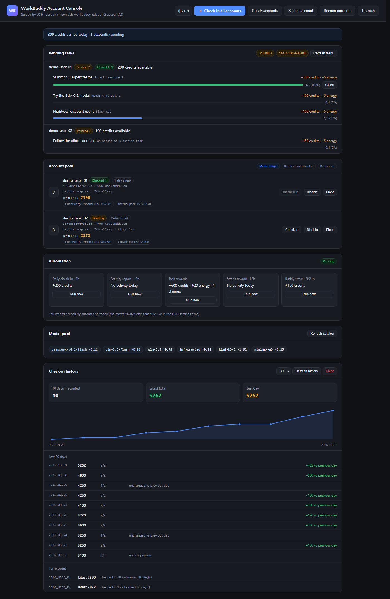

# dsh-workbuddy-console

> **This plugin has absorbed `dsh-workbuddy-xdpool`** (account pool, model pool,
> check-in). They are now **one plugin**: install once and the Settings dialog
> shows both the pool card and the skill market — no separate enable, no
> separate update.
> XDTrees' original code is kept verbatim under
> [vendor/xdpool/](vendor/xdpool/); see [THIRD-PARTY.md](THIRD-PARTY.md)
> for licensing and how to upgrade it.

**WorkBuddy multi-account console for [DeepSeek Harness](https://github.com/deepseek-ai/deepseek-harness)** —
a web page inside DSH that manages multiple WorkBuddy accounts, checks in every account with one click,
and shows what is still left to do.

The page is served by **DSH's own webserver**, so it is available whenever DSH runs —
no separate process, and no "connection refused".



## Features

| Feature | Description |
|---|---|
| **Check in all accounts** | Walks every enabled account serially (paced to avoid rate limits), reports per account |
| **Pending tasks** | Lists unfinished growth tasks with progress bars, what's missing, and the credits at stake; claimable ones get a button |
| **Account check** | Probes the upstream **live** to verify each session, classifying it Valid / Invalid / Unknown |
| **Sign in account** | Two entry points: open the website sign-in page, or launch the desktop app. Never stores or fills in credentials |
| **Check-in history** | Records a snapshot on every check-in and page load, then charts the credit trend over 7/30/90 days |
| Account pool | Nickname, streak, today's status, per-package credits, cooldown and credit floor |
| Automation | Today's earnings and schedule for the 5 jobs, runnable on demand |
| Model pool | Model list with credit multipliers |
| Account actions | Check in, enable/disable, set a credit floor |
| **Bilingual UI** | Chinese and English, switchable in the header |

## Quick start

### Prerequisites

1. **DSH installed and working**
2. **[dsh-workbuddy-xdpool](https://github.com/XDTrees/dsh-workbuddy-xdpool) installed** —
   it provides account discovery, check-in, credits and tasks
3. **A WorkBuddy sign-in on this machine** (or an existing auth file)

### Install

```bash
git clone https://github.com/dhdbvcg/dsh-workbuddy-console.git
cd dsh-workbuddy-console
node scripts/install.mjs
```

The installer locates your DSH profile, registers the plugin and writes the dependency
(in the correct `link:` form). Then **restart DSH**.

Options:

```bash
node scripts/install.mjs --dry-run              # show what it would do
node scripts/install.mjs --profile <dir>        # target a specific profile
node scripts/install.mjs --uninstall            # remove the registration
```

### Open

```
http://127.0.0.1:<DSH port>/wb-console
```

The DSH port is the one you already use for the GUI.

> ⚠️ **Never use `file:` instead of `link:`**
>
> Under pnpm, `file:` means **copy**: after installing, none of your source edits take effect
> and DSH keeps loading the old code. It is very hard to spot because the directory looks fine.
> The installer always writes `link:`; verify with:
>
> ```powershell
> (Get-Item "<profile>/node_modules/dsh-workbuddy-console" -Force).LinkType
> # expect Junction; empty means it is a copy — reinstall with link:
> ```

## Why this exists

`dsh-workbuddy-xdpool` is a model-pool plugin and does its job well, but **some things stay invisible**:

- **Unfinished tasks.** The plugin only reports a `claimableCount` (tasks that are done but unclaimed).
  Tasks that are *almost* done never show up. On a real account: 18 tasks, 15 claimed, 3 unfinished —
  the plugin says `claimableCount: 0`, this console lists all 3.
- **No batch check-in.** The plugin's check-in route accepts a single `accountId` per call.
- **Session validity is hard to judge.** The `expiresAt` in a local auth file is *not* updated when
  the upstream revokes a token, so "not expired" does not mean "still works". The only trustworthy
  check is to actually make a request.
- **No overview.** The information is scattered across a settings card, logs and the CLI.
- **No history.** Everything shows *current* state; yesterday's numbers are gone.

## How it relates to xdpool

This plugin is a **front-end for xdpool** and does not reimplement account discovery or upstream calls:

```
browser  →  DSH(:port)/wb-console  →  this plugin  →  /plugins/dsh-workbuddy-xdpool  →  WorkBuddy upstream
```

| Capability | Source |
|---|---|
| Account discovery, check-in, credits, tasks, model catalog, automation | xdpool |
| Batch check-in across all accounts | **added here** |
| Pending-task view, account health check, sign-in entry, history chart | **added here** |
| Web UI, i18n | **added here** |

Credentials stay under xdpool's control. This plugin only *reads* local auth files —
it never persists or transmits them anywhere.

## Account check: why not just read `expiresAt`

The upstream does not rewrite the local expiry when it revokes a token, so a "not expired"
historical snapshot may already be rejected.

This feature really sends `POST /v2/billing/meter/checkin-activity-status`:

| Result | Signal | Meaning |
|---|---|---|
| **Valid** | HTTP 200 + `code:0` | Upstream accepted it; check-in state comes back too |
| **Invalid** | HTTP 401 / 403 | Needs a new sign-in |
| **Unknown** | network error / other response | Not enough evidence to call it dead |

Each row also shows where the credential came from: the **desktop app's live sign-in**
(`workbuddy-desktop.info`) or a **historical snapshot**
(`workbuddy-desktop.<timestamp>.<pid>.<uuid>.info`). Snapshots can outlive a desktop sign-out —
but that does not mean they will keep working.

## Pending tasks: how they are classified

Data comes from `GET {chat}/v2/activity/growth/tasks`, classified with the **same rules as
xdpool's `parseTask`** (the plugin's own client is reused), so the numbers here always match
what the plugin's automation logs report.

| State | Rule |
|---|---|
| **Pending** | `current < target`, not claimed, not locked |
| **Claimable** | `current >= target`, not claimed |
| Claimed | `accept_status === "claimed"` (hidden by default) |
| Locked | `locked === true` (hidden by default) |

Claiming reuses the plugin's `claimTaskReward`, which already handles two easy-to-miss details:
the task code travels in the **PATH** (not the body), and the request needs the growth-centre
`Origin`/`Referer` plus `x-client-platform: web`.

## History

A snapshot is appended to a local JSONL file on every check-in and page load
(`<DSH home>/plugin-data/dsh-workbuddy-console/history.jsonl`).

Two deliberate choices:

- **JSONL, not a JSON array** — appending does not require reading and rewriting the whole file,
  and an interrupted write costs at most the last line instead of the entire history.
- **Per (day, account), only the last snapshot counts** — refreshing the page repeatedly must not
  inflate the totals. Summing would over-count badly.

Retention is 90 days / 5000 records, pruned automatically after each check-in.
Nothing leaves the machine.

## About "automatic sign-in"

**Fully automatic sign-in is not possible, and that is by design upstream.**
WorkBuddy uses interactive browser OAuth (Keycloak, `www.codebuddy.cn`); obtaining a new token
requires a human to complete the flow in a browser.

So this plugin offers two entry points and **never stores or fills in credentials**:

1. **Open the sign-in page** — sign in, then come back and click "Rescan accounts"
2. **Launch the desktop app** — if it is already signed in it rewrites its session file

Both are restricted by a domain allow-list (`codebuddy.cn` / `workbuddy.cn` / `codebuddy.ai`),
so this endpoint cannot be used as an arbitrary URL opener.

## Environment variables

| Variable | Default | Purpose |
|---|---|---|
| `DSH_PROFILE_DIR` | auto-detected | DSH profile directory (used to locate xdpool) |
| `DSH_HOME` | `~/.dsh` | DSH root |
| `WORKBUDDY_XDPOOL_ENTRY` | — | Absolute path to xdpool's `lib/index.js` |
| `WORKBUDDY_AUTH_FILE` | auto-detected | WorkBuddy auth file or directory |
| `WB_CONSOLE_DATA_DIR` | `<DSH home>/plugin-data/...` | Where history is stored |
| `WB_CONSOLE_HISTORY_DAYS` | `90` | History retention in days |

## API

Same-origin; every mutating route accepts POST only.

| Method | Path | Description |
|---|---|---|
| GET | `/wb-console` | The page |
| GET | `/wb-console/api/mode` | Whether xdpool is reachable |
| GET | `/wb-console/api/overview` | Accounts + check-in + credits + automation + models |
| POST | `/wb-console/api/claim` | Check in all accounts (optional `ids` filter) |
| GET | `/wb-console/api/tasks` | Pending tasks (`?all=1` includes finished) |
| POST | `/wb-console/api/tasks/claim` | Claim one task reward |
| GET | `/wb-console/api/accounts/check` | Account health check |
| GET | `/wb-console/api/history` | Check-in history (`?days=7|30|90`) |
| POST | `/wb-console/api/history/prune` | Prune old history |
| POST | `/wb-console/api/history/clear` | Clear history |
| POST | `/wb-console/api/accounts/disabled` | Enable/disable an account |
| POST | `/wb-console/api/accounts/credit-reserve` | Set credit floor |
| POST | `/wb-console/api/accounts/rescan` | Rescan accounts |
| POST | `/wb-console/api/login/open` | Open the website sign-in page |
| POST | `/wb-console/api/login/desktop` | Launch the desktop app |
| POST | `/wb-console/api/automation/run` | Run an automation job |
| GET | `/wb-console/api/diag` | Diagnostics |

## Development

```bash
node test/run-all.mjs     # all unit tests (switches into the DSH profile to resolve xdpool)
node test/run-ci.mjs      # same suite as CI runs (no profile or credentials needed)
node scripts/build-dict.mjs   # regenerate web/i18n-dict.js from web/i18n.js
```

| File | Count | Covers |
|---|---|---|
| `selftest.mjs` | 19 | Plugin shape, routes, static assets, proxy, batch check-in, forwarding |
| `check-test.mjs` | 19 | JWT, credential scan, probe verdicts, health summary, login allow-list |
| `routes-test.mjs` | 12 | Route registration, page elements, front-end URL joining |
| `tasks-test.mjs` | 7 | Task reading, state classification, batch summary, failure isolation |
| `tasks-route-test.mjs` | 9 | Task routes, claim validation, uid allow-list |
| `i18n-test.mjs` | 3 | Dictionary key parity, placeholder consistency, no empty values |
| `installer-test.mjs` | 13 | Install / uninstall / idempotency / preserving other plugins |
| `history-test.mjs` | 16 | Recording, corruption tolerance, per-day de-duplication, pruning |

Browser end-to-end (needs Chrome; `e2e-i18n.mjs` also runs without DSH):

```bash
node test/e2e-i18n.mjs    # renders the page in zh + en, asserts zero JS errors
node test/screenshot.mjs  # regenerates the screenshots in assets/
```

### Why tests go through `run-all.mjs`

`tasks.mjs` must `import dsh-workbuddy-xdpool`, which only exists inside a DSH profile's
`node_modules`, while the test files use relative imports (`../lib/...`). `run-all.mjs`
copies the plugin into the profile before running, satisfying both at once.

## Troubleshooting

### The page will not open / shows "Response was not JSON"

Check the diagnostics endpoint first:

```
http://127.0.0.1:<port>/wb-console/api/diag
```

Then look at the browser's Network panel: if a request URL contains **`/api/api/`**, the prefix
was joined twice. The correct form is `/wb-console/api/mode`.

### Behaviour does not change after a restart

It is almost certainly installed as a copy rather than a link — see "Never use `file:`" above.

### The task panel says it cannot find `dsh-workbuddy-xdpool`

The plugin is not where this one looks. Set `DSH_PROFILE_DIR` to the profile that has it, or
`WORKBUDDY_XDPOOL_ENTRY` to the absolute path of its `lib/index.js`.

## Disclaimer

- This project manages **your own** accounts only.
- Follow the [WorkBuddy terms of service](https://www.codebuddy.cn/) and applicable law.
- Automation can trip upstream risk controls. This project paces its requests, but makes no
  guarantee about the state of your accounts.
- Not affiliated with Tencent, WorkBuddy or CodeBuddy.

## Credits

- [dsh-workbuddy-xdpool](https://github.com/XDTrees/dsh-workbuddy-xdpool) — account discovery and upstream calls
- [DeepSeek Harness](https://github.com/deepseek-ai/deepseek-harness) — plugin host

## License

[MIT](LICENSE)
