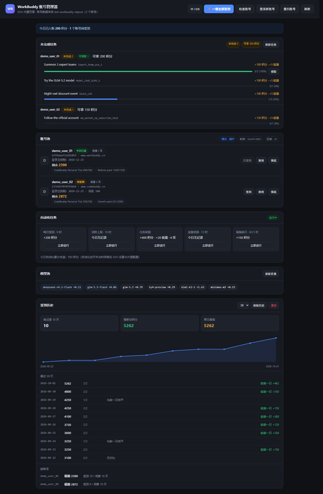

# dsh-workbuddy-console

**WorkBuddy 多账号控制台** —— 一个跑在 [DeepSeek Harness](https://github.com/deepseek-ai/deepseek-harness) 里的网页，
用来管理多个 WorkBuddy 账号、一键领取所有账号的积分，并查看还剩什么没做完。

页面挂在 **DSH 自己的 webServer** 上，所以只要 DSH 在跑，页面就在 ——
不需要额外启动进程，也不会有「拒绝连接」。

[English](README.en.md)



## 功能

| 功能 | 说明 |
|---|---|
| **一键全部签到** | 批量遍历所有启用账号（串行 + 间隔防风控），逐账号汇报结果 |
| **未完成任务** | 列出还没做完的成长任务：进度条、还差多少、能拿多少积分；达标的可一键领取 |
| **账号检查** | 逐个账号**实时调上游**验证登录态，区分「有效 / 已失效 / 无法确认」 |
| **登录新账号** | 打开官网登录页 / 拉起桌面版两个入口，不存储、不代填密码 |
| **签到历史** | 每次签到与打开页面自动记一笔，按 7/30/90 天绘制积分趋势图 |
| 账号池 | 昵称、连签天数、今日状态、各积分包余额、冷却与保底状态 |
| 自动化任务 | 5 个任务的今日收益与计划时间，可手动触发 |
| 模型池 | 模型列表与积分倍率 |
| 账号操作 | 签到、启用/禁用、设置保底积分 |
| **中英双语** | 界面可切换，右上角「中 / EN」 |

## 快速开始

### 前置条件

1. **DSH 已安装并能正常运行**
2. **[dsh-workbuddy-xdpool](https://github.com/XDTrees/dsh-workbuddy-xdpool) 插件已安装**
   —— 账号发现、签到、积分、任务数据都由它提供
3. **本机已登录过 WorkBuddy 桌面端**（或已有 auth 文件）

### 安装

```bash
git clone https://github.com/dhdbvcg/dsh-workbuddy-console.git
cd dsh-workbuddy-console
node scripts/install.mjs
```

安装脚本会自动定位 DSH profile、注册插件、并以正确的 `link:` 形式写入依赖。
然后**重启 DSH**。

可选参数：

```bash
node scripts/install.mjs --dry-run          # 只看会做什么，不改文件
node scripts/install.mjs --profile <目录>   # 指定 profile
node scripts/install.mjs --uninstall        # 卸载注册
```

<details>
<summary>手动安装（不想跑脚本时）</summary>

在 profile 的 `package.json` 的 `dependencies` 里加：

```jsonc
"dsh-workbuddy-console": "link:/绝对路径/dsh-workbuddy-console"
```

在 `cordis.patch.yml` 末尾加：

```yaml
- insert:
    - id: workbuddy-console
      name: dsh-workbuddy-console
```

然后 `pnpm install`。

</details>

### 访问

```
http://127.0.0.1:<DSH端口>/wb-console
```

DSH 端口就是你平时打开 GUI 的端口。

> ⚠️ **必须用 `link:` 而不是 `file:`**
>
> `file:` 在 pnpm 下是**拷贝**语义：装完之后你对源码的任何修改都不会生效，
> DSH 永远读到旧代码 —— 而且这个坑极难发现，因为目录看起来完全正常。
>
> ```powershell
> # 验证当前是哪种
> (Get-Item "<profile>/node_modules/dsh-workbuddy-console" -Force).LinkType
> # 期望 Junction；输出为空 = 是拷贝，必须改成 link: 重装
> ```

## 为什么需要这个

`dsh-workbuddy-xdpool` 是模型池插件，它把事情做得很好，但**有些东西看不见**：

- **未完成任务**：插件只在自动化日志里报一个 `claimableCount`（达标未领的数量），
  「还差一点点就达标」的任务完全不可见。实测 18 个任务里 15 个已领、3 个未完成，
  插件显示 `claimableCount: 0`，而这个控制台会列出那 3 个。
- **没有批量签到**：插件的签到路由一次只接受一个 `accountId`。
- **登录态真假难辨**：本地 auth 文件里的 `expiresAt` 会被上游撤销而**不更新**，
  所以「显示未过期」不等于「还能用」。唯一可信的检查是真的发一次请求。
- **没有一个总览页面**：这些信息散在设置卡片、日志和 CLI 里。
- **没有历史**：所有信息都是「当前状态」，昨天的数字就没有了。

## 和 xdpool 的关系

本插件是 xdpool 的**前端**，不重复实现账号发现与上游调用：

```
浏览器  →  DSH(:port)/wb-console  →  本插件  →  /plugins/dsh-workbuddy-xdpool  →  WorkBuddy 上游
```

| 能力 | 来源 |
|---|---|
| 账号发现、签到、积分、任务、模型目录、自动化 | xdpool |
| 一键全部签到（批量） | **本插件补齐** |
| 未完成任务视图、账号体检、登录入口、历史趋势 | **本插件新增** |
| 网页界面、中英双语 | **本插件提供** |

账号凭证始终由 xdpool 管理，本插件只读本机 auth 文件，**不落盘、不外发**。

## 账号检查：为什么不看 `expiresAt`

上游撤销 token 时**不会**改写本地文件的过期时间。
所以一个「显示未过期」的历史快照 token，完全可能已经被上游拒绝。

本功能真的发一次 `POST /v2/billing/meter/checkin-activity-status`：

| 结果 | 判据 | 含义 |
|---|---|---|
| **有效** | HTTP 200 + `code:0` | 上游接受，顺带带出签到状态 |
| **已失效** | HTTP 401 / 403 | 需要重新登录 |
| **无法确认** | 网络错误 / 其它响应 | 不能据此断言失效 |

同时标出凭证来源：**桌面端当前登录**（`workbuddy-desktop.info`）
还是**历史快照**（`workbuddy-desktop.<时间戳>.<pid>.<uuid>.info`）。
快照可能在桌面端登出后依然可用，但不代表以后还能用。

## 未完成任务怎么算

数据来自 `GET {chat}/v2/activity/growth/tasks`，分类口径与 xdpool 的 `parseTask`
**完全一致**（直接复用插件导出的 client），所以这里显示的数量与插件自动化日志对得上。

| 状态 | 判据 |
|---|---|
| **未完成** | `current < target` 且未领取、未锁定 |
| **可领取** | `current >= target` 且未领取 |
| 已领取 | `accept_status === "claimed"`（默认不显示） |
| 锁定 | `locked === true`（默认不显示） |

领取复用插件的 `claimTaskReward`，它已处理两个易错点：
taskCode 走 **PATH** 而非 body，且必须带 growth-center 的 `Origin`/`Referer`
和 `x-client-platform: web`。

## 签到历史

每次签到与每次打开页面，都会把当时的快照追加到本地 JSONL
（`<DSH 根目录>/plugin-data/dsh-workbuddy-console/history.jsonl`）。

两个刻意的设计：

- **用 JSONL 而不是 JSON 数组** —— 追加写入不必读全量再重写整个文件；
  写入被中断最多丢最后一行，不会把已有历史全毁掉。
- **同一天同一账号只取最后一次快照** —— 反复刷新页面不能把总数刷大。
  如果直接求和会严重重复计数。

保留 90 天 / 5000 条，每次签到后自动裁剪。数据不出本机。

## 关于「自动登录」

**做不到全自动，这是上游设计使然。**
WorkBuddy 使用交互式浏览器 OAuth（Keycloak，域 `www.codebuddy.cn`），
拿新 token 必须有人在浏览器里真的完成登录。

本插件因此只提供两个入口，**绝不存储或代填账号密码**：

1. **打开官网登录页** —— 登录后回来点「重扫账号」
2. **拉起 WorkBuddy 桌面版** —— 桌面版重新登录会写出新的 live 文件

两个入口都有域名白名单（只允许 `codebuddy.cn` / `workbuddy.cn` / `codebuddy.ai`），
不会被当成任意 URL 跳板。

## 环境变量

| 变量 | 默认 | 说明 |
|---|---|---|
| `DSH_PROFILE_DIR` | 自动探测 | 指定 DSH profile 目录（用于定位 xdpool） |
| `DSH_HOME` | `~/.dsh` | DSH 根目录 |
| `WORKBUDDY_XDPOOL_ENTRY` | — | 直接指定 xdpool 的 `lib/index.js` 绝对路径 |
| `WORKBUDDY_AUTH_FILE` | 自动探测 | 指定 WorkBuddy auth 文件或目录 |
| `WB_CONSOLE_DATA_DIR` | `<DSH>/plugin-data/...` | 历史数据的存放目录 |
| `WB_CONSOLE_HISTORY_DAYS` | `90` | 历史保留天数 |

## API

页面同源，浏览器可直接调用。所有写操作只接受 POST。

| 方法 | 路径 | 说明 |
|---|---|---|
| GET | `/wb-console` | 页面 |
| GET | `/wb-console/api/mode` | 探测 xdpool 是否在线 |
| GET | `/wb-console/api/overview` | 账号 + 签到 + 积分 + 自动化 + 模型 |
| POST | `/wb-console/api/claim` | 一键全部签到（可传 `ids` 过滤） |
| GET | `/wb-console/api/tasks` | 未完成任务（`?all=1` 含已完成） |
| POST | `/wb-console/api/tasks/claim` | 领取单个任务奖励 |
| GET | `/wb-console/api/accounts/check` | 账号体检 |
| GET | `/wb-console/api/history` | 签到历史（`?days=7\|30\|90`） |
| POST | `/wb-console/api/history/prune` | 裁剪历史 |
| POST | `/wb-console/api/history/clear` | 清空历史 |
| POST | `/wb-console/api/accounts/disabled` | 启用/禁用账号 |
| POST | `/wb-console/api/accounts/credit-reserve` | 保底积分 |
| POST | `/wb-console/api/accounts/rescan` | 重扫账号 |
| POST | `/wb-console/api/login/open` | 打开官网登录页 |
| POST | `/wb-console/api/login/desktop` | 拉起桌面版 |
| POST | `/wb-console/api/automation/run` | 手动触发任务 |
| GET | `/wb-console/api/diag` | 诊断信息 |

## 开发

```bash
node test/run-all.mjs     # 全部单测（会切到 DSH profile 以解析 xdpool）
node test/run-ci.mjs      # CI 跑的那套（不需要 profile 与真实凭证）
node scripts/build-dict.mjs   # 由 web/i18n.js 生成 web/i18n-dict.js
```

| 文件 | 项数 | 覆盖 |
|---|---|---|
| `selftest.mjs` | 19 | 插件形状、路由、静态资源、代理、批量签到、通用转发 |
| `check-test.mjs` | 19 | JWT、凭证扫描、探活判定、体检汇总、登录域名白名单 |
| `routes-test.mjs` | 12 | 路由注册、页面元素、前端 URL 拼接 |
| `tasks-test.mjs` | 7 | 任务读取、状态归类、批量汇总、失败隔离 |
| `tasks-route-test.mjs` | 9 | 任务路由、领取参数校验、uid 白名单 |
| `i18n-test.mjs` | 3 | 中英字典 key 对齐、占位符一致、无空值 |
| `installer-test.mjs` | 13 | 安装 / 卸载 / 幂等 / 保留其它插件配置 |
| `history-test.mjs` | 16 | 记录、容错、同日去重、裁剪 |

浏览器端到端（需要 Chrome；`e2e-i18n.mjs` 不依赖 DSH）：

```bash
node test/e2e-i18n.mjs    # 中英两种语言渲染，断言零 JS 异常 + 折线图已画出
node test/screenshot.mjs  # 重新生成 assets/ 里的截图
```

### 为什么测试由 `run-all.mjs` 驱动

`tasks.mjs` 需要 `import dsh-workbuddy-xdpool`，而那个包只装在 DSH profile 的
`node_modules` 里。`run-all.mjs` 会自动把插件复制到 profile 下的临时目录再跑，
让「解析 xdpool」和「相对 import」两个需求同时满足。

## 排障

### 页面打不开 / 显示「响应不是 JSON」

先看诊断接口：

```
http://127.0.0.1:<端口>/wb-console/api/diag
```

再看浏览器 Network：如果请求 URL 出现 **`/api/api/`**，说明前端把前缀拼了两次。
正确形式是 `/wb-console/api/mode`。

### 重启后行为没变

八成是装成了拷贝而不是链接，见上文「必须用 link:」。

### 任务面板显示「找不到 dsh-workbuddy-xdpool」

插件不在默认探测路径。设置 `DSH_PROFILE_DIR` 指向装了 xdpool 的 profile，或
`WORKBUDDY_XDPOOL_ENTRY` 直接给出 `lib/index.js` 的绝对路径。

## 免责声明

- 本项目仅用于管理**你自己**的账号。
- 请遵守 [WorkBuddy 服务条款](https://www.codebuddy.cn/) 与相关法律法规。
- 自动化操作可能触发上游风控，本项目已做限流（串行 + 间隔），但不对账号状态作任何保证。
- 与腾讯 / WorkBuddy / CodeBuddy 官方无任何关联。

## 致谢

- [dsh-workbuddy-xdpool](https://github.com/XDTrees/dsh-workbuddy-xdpool) —— 账号发现与上游调用
- [DeepSeek Harness](https://github.com/deepseek-ai/deepseek-harness) —— 插件宿主

## License

[MIT](LICENSE)
